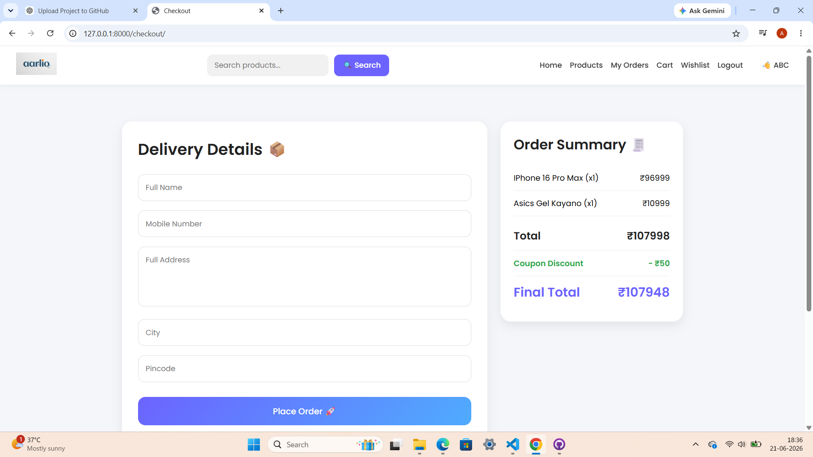

# Aarlio E-Commerce Website

A Django-based eCommerce website with modern UI and shopping features.

## Features
- User Registration & Login
- Product Listing
- Product Search
- Add to Cart
- Wishlist
- Coupon System
- Checkout Process
- Order Management

## Tech Stack
- Python
- Django
- HTML
- CSS
- Bootstrap
- SQLite

## Screenshots
## Home Page

## Cart

## Wishlist

## Checkout

pip install -r requirements.txt
python manage.py migrate
python manage.py runserver
